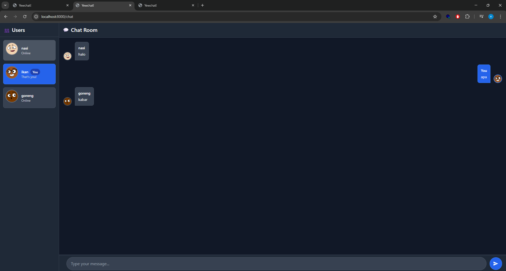

# 3.1

Berikut tampilan yew chat original, terdapat 2 user yang saling mengirimkan pesan

# 3.2

Saya telah mengubah Yew Chat dengan menerapkan dark theme yang konsisten menggunakan warna navy gelap untuk background utama, sidebar yang lebih gelap, dan elemen UI lainnya mengikuti tema gelap. User yang sedang aktif diberikan highlight dengan background biru terang, badge "You", dan status teks berubah menjadi "That's you!", sementara user lain menggunakan background abu-abu gelap dengan status "Online". Avatar pengguna kini berfungsi dengan baik setelah link URL diperbarui ke endpoint Dicebear, sehingga setiap user memiliki avatar unik berdasarkan username mereka. Selain itu, saya menambahkan border di elemen seperti user cards dan avatar agar tampilannya lebih jelas. Bagian input chat di bawah juga sudah menyesuaikan dengan dark theme, menggunakan background abu-abu gelap dan tulisan placeholder yang cukup kontras. Terakhir, aplikasi ini diuji dengan beberapa tab browser terbuka sekaligus, membuktikan fitur multi-user chat real-time masih berjalan lancar sama seperti yewchat original